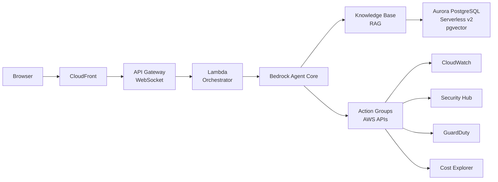

# AWS LaunchPad

AI-powered virtual assistant deployable in customer AWS accounts. Built on Amazon Bedrock Agent Core to drive GenAI service adoption across monitoring, security, modernization, and general AWS guidance.

## Overview

AWS LaunchPad provides a web-based chatbot that customers and partners can deploy in their own AWS accounts with a single `cdk deploy` command. The assistant leverages Amazon Bedrock to answer AWS questions, monitor infrastructure, assess security posture, and execute controlled actions — all through a conversational interface.

## Key Features

- **AWS General Assistant:** Answer questions about AWS services, architecture, and best practices via RAG-powered Knowledge Base
- **Monitoring:** Query CloudWatch metrics, alarms, logs, and health checks
- **Security:** Review Security Hub findings, GuardDuty alerts, compliance status, and IAM configuration
- **Account Management:** List and describe resources (EC2, RDS, S3, Lambda), query costs via Cost Explorer
- **Controlled Actions:** Execute approved operations (create alarms, enable logging, apply remediations) with user confirmation

## Architecture



## Tech Stack

| Component | Service |
|-----------|---------|
| Frontend | React + Amplify Hosting |
| API | API Gateway (WebSocket) |
| Orchestrator | Lambda (Python) |
| Agent | Amazon Bedrock Agent Core |
| Model | Claude Sonnet (Bedrock) |
| Knowledge Base | Bedrock KB + Aurora PostgreSQL Serverless v2 (pgvector) |
| AWS Actions | Lambda Action Groups |
| IaC | CDK (TypeScript) |
| Auth | Amazon Cognito |

## Security

- No static credentials — all components use IAM Roles with temporary credentials (STS)
- Cognito authentication with optional MFA and SAML/OIDC federation
- Two permission levels:
  - **Viewer:** Read-only (query metrics, list resources, view findings)
  - **Operator:** Read + controlled actions (create alarms, enable logging, apply remediations)
- Least privilege IAM policies per Lambda function
- Encryption in transit (TLS 1.2+) and at rest (KMS)
- CloudTrail audit logging for all agent-initiated API calls
- Destructive actions require explicit user confirmation

## Deployment

### Prerequisites

- AWS CLI configured with appropriate credentials
- Node.js 18+
- AWS CDK CLI (`npm install -g aws-cdk`)

### Quick Start

```bash
git clone git@ssh.gitlab.aws.dev:rayihbou/aws-launchpad.git
cd aws-launchpad
npm install
cdk deploy
```

The stack outputs the application URL. Custom domain is optional — pass it as a CDK context parameter:

```bash
cdk deploy -c domainName=assistant.example.com -c hostedZoneId=Z0123456789
```

## Development Phases

| Phase | Scope | Status |
|-------|-------|--------|
| Phase 1 (MVP) | CDK stack, Bedrock Agent + KB, CloudWatch Action Group, React chat UI | In Progress |
| Phase 2 | Security Hub and GuardDuty Action Groups | Planned |
| Phase 3 | Resource inventory, Cost Explorer, modernization recommendations | Planned |
| Phase 4 | Controlled actions with confirmation, conversation history, streaming | Planned |

## Future Roadmap

The original LaunchPad vision includes six specialized migration agents (Assessment Automator, Discovery Assistant, Database Modernization Advisor, DR/DRP Planner, Code Modernization Advisor, Post-Migration Documentation Generator). These remain in the roadmap for future phases.

## Author

Rayih Bou — Solutions Architect, AWS LATAM CSC

## License

Amazon Confidential — Internal Use
