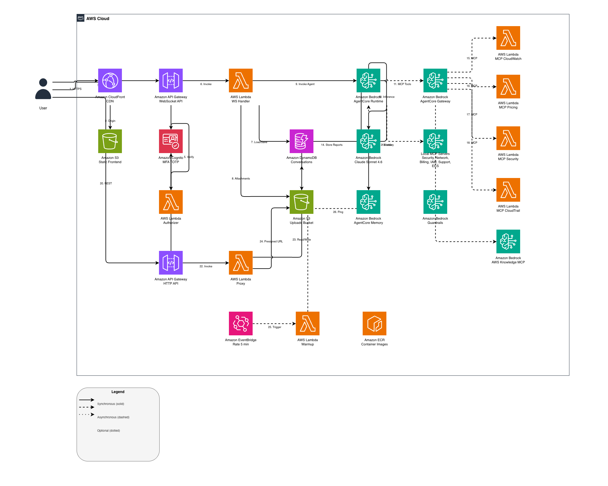

# AWS LaunchPad

AI-powered cloud operations assistant deployable in any AWS account with a single `cdk deploy`. Built on Amazon Bedrock AgentCore with Strands Agents SDK, 120+ MCP tools, and long-term memory.



## What It Does

AWS LaunchPad is a read-only assistant that helps teams monitor, analyze, and troubleshoot their AWS infrastructure through a conversational interface. When it finds issues, it provides ready-to-execute CLI commands — the agent never performs write operations.

**Capabilities:**
- Security posture analysis (Security Hub, GuardDuty, Inspector, WAF, IAM, S3, RDS)
- Cost management (Cost Explorer, budgets, Compute Optimizer, Savings Plans, Free Tier)
- Network diagnostics (VPC, security groups, NACLs, Transit Gateway, flow logs)
- Container operations (ECS clusters/services/tasks, EKS clusters/nodegroups)
- Audit and compliance (CloudTrail events, Config rules, Well-Architected reviews)
- Downloadable HTML reports with AWS Dark Theme and copy-to-clipboard commands
- Long-term memory that remembers user context across sessions
- File attachments (images, PDFs, documents) for analysis
- Multi-language support (English, Spanish, Portuguese)

## Quick Deploy

### Prerequisites

- AWS account with [Amazon Bedrock model access](https://docs.aws.amazon.com/bedrock/latest/userguide/model-access.html) enabled for Claude Sonnet 4
- Node.js 18+ and Docker installed (or use AWS CloudShell which has both)
- AWS CDK bootstrapped in the target account/region (`cdk bootstrap`)

### Deploy via CloudShell (recommended, zero local setup)

Open [AWS CloudShell](https://console.aws.amazon.com/cloudshell) and run:

```bash
git clone https://github.com/aws-samples/aws-launchpad.git
cd aws-launchpad
npm install
cdk bootstrap   # only needed once per account/region
cdk deploy -c adminEmail=you@company.com
```

### Deploy from local machine

```bash
git clone https://github.com/aws-samples/aws-launchpad.git
cd aws-launchpad
npm install
cdk deploy -c adminEmail=you@company.com
```

### Configuration options

| Parameter | Required | Default | Description |
|-----------|----------|---------|-------------|
| `adminEmail` | Yes | — | Email for the initial admin user (receives temporary password) |
| `language` | No | `en` | UI and agent language (`en`, `es`, `pt`) |
| `modelId` | No | Claude Sonnet 4.6 | Bedrock model ID or inference profile |
| `domainName` | No | — | Custom domain (e.g., `launchpad.example.com`) |
| `hostedZoneId` | No | — | Route 53 Hosted Zone ID for custom domain |
| `zoneName` | No | — | Route 53 zone name for custom domain |
| `enableCrossAccount` | No | `false` | Enable multi-account visibility for AWS Organizations |

Example with all options:

```bash
cdk deploy \
  -c adminEmail=admin@company.com \
  -c language=es \
  -c domainName=launchpad.example.com \
  -c hostedZoneId=Z0123456789ABC
```

### Multi-Account Visibility (optional)

For partners or teams managing multiple AWS accounts under an AWS Organization, LaunchPad can query resources across all linked accounts from a single deployment in the payer/management account.

**Enable cross-account:**

```bash
cdk deploy -c adminEmail=admin@company.com -c enableCrossAccount=true
```

**What this adds:**
- `sts:AssumeRole` and `organizations:List*` permissions to the agent's IAM role
- Three new tools: `list_organization_accounts`, `assume_role`, `generate_cross_account_setup`
- System prompt rules for cross-account context awareness

**Setup linked accounts:**

After deploying, ask the agent: *"I need to access my other accounts"*. The agent will:
1. List all accounts in your organization
2. Generate a CloudFormation template that creates a `LaunchPadReadOnlyRole` in each linked account
3. Provide CLI commands to deploy individually or via StackSet (all accounts at once)

The generated role grants `ReadOnlyAccess` and trusts only the LaunchPad runtime role in the payer account.

**Usage:**

```
"What accounts do I have?"           → Lists all accounts with access status
"Check EC2 in account 111222333444"  → AssumeRole + describe instances
"Generate a security report for the Production account" → Cross-account analysis + HTML report
```

When cross-account is not enabled, the agent works exclusively with the local account (default behavior).

### First login

1. Check your email for the temporary password from Cognito
2. Open the CloudFront URL from the CDK output
3. Log in with your email and temporary password
4. Set a new password and configure MFA (TOTP — Google Authenticator, Authy, etc.)
5. Start chatting with the assistant

To add more users, click the users icon in the header to open the Cognito User Pool console, or ask the agent for the CLI command.

## Architecture

The solution deploys entirely within the customer's AWS account. No data leaves the account except for Bedrock model inference.

| Component | Service |
|-----------|---------|
| Frontend | React + Vite → S3 + CloudFront |
| Agent | Bedrock AgentCore Runtime (Docker arm64, Strands SDK) |
| Model | Claude Sonnet 4.6 via Amazon Bedrock (configurable) |
| MCP Tools | 6 local servers (stdio) + 5 Gateway targets + 15 boto3 tools |
| Chat API | WebSocket API Gateway (Lambda Authorizer, 900s timeout) |
| REST API | HTTP API Gateway (Cognito JWT auth) |
| Auth | Amazon Cognito (MFA TOTP mandatory) |
| Memory | AgentCore Memory (long-term facts) + DynamoDB (conversation history) |
| Security | Bedrock Guardrails (content filtering, PII redaction) |
| Warmup | EventBridge (5 min) + Lambda ping |
| IaC | AWS CDK with @aws-cdk/aws-bedrock-agentcore-alpha |

### MCP Tools (120+)

| Source | Tools | Examples |
|--------|-------|---------|
| Local MCP (stdio) | ~120 | Well-Architected Security, Network, Billing, IAM (readonly), Support, ECS |
| Gateway MCP (Lambda) | ~12 | CloudWatch, Pricing, Security Hub, CloudTrail |
| Gateway MCP (remote) | ~10 | AWS Knowledge (documentation) |
| boto3 @tools | 15 | S3, EC2, CloudWatch, Cost Explorer, EKS, WAF, RDS, HTML reports |

## Security Design

- **Read-only agent:** Never executes write or destructive actions. Provides CLI commands for the user to run in CloudShell
- **No static credentials:** All components use IAM Roles with temporary credentials via STS
- **MFA mandatory:** Cognito TOTP required for all users
- **Least privilege IAM:** Separate policies per MCP server and tool category
- **MCP server protections:** IAM readonly flag, ALLOW_WRITE=false where supported
- **Content filtering:** Bedrock Guardrails blocks prompt injection, PII redaction, off-topic requests
- **Ephemeral file handling:** Attachments auto-delete after processing, reports expire in 24 hours

## Cost Estimation

Based on AWS Pricing API (us-east-1, on-demand). Bedrock tokens dominate ~85% of total cost.

| Usage Level | Users | Messages/month | Estimated Cost |
|-------------|-------|----------------|----------------|
| Low | 5 | 500 | ~$7/month |
| Medium | 20 | 2,500 | ~$35/month |
| High | 50 | 10,000 | ~$140/month |

Cognito is free up to 10,000 MAU. Lambda, API Gateway, DynamoDB, and S3 are effectively free at these volumes. See [docs/cost-estimation.html](docs/cost-estimation.html) for detailed breakdown.

## Project Structure

```
agent/                  # AgentCore Runtime container
  app.py                # Agent: tools, MCP servers, system prompt
  Dockerfile            # Python 3.12-slim + MCP server packages
  requirements.txt      # Dependencies
frontend/               # React frontend (Vite)
  src/components/       # Chat, Header, Login, Sidebar, MessageInput
  src/hooks/            # useAuth, useWebSocket, useIdleTimeout
  src/i18n/             # en.json, es.json, pt.json
scripts/                # Lambda handlers
  websocket/            # ws_handler.py, authorizer.py
  proxy/                # proxy_handler.py
  warmup/               # warmup_handler.py
mcp-lambdas/            # Gateway MCP Lambda handlers
  cloudwatch/           # Metrics, alarms, logs
  cloudtrail/           # Audit events
  pricing/              # AWS Pricing API
  wa-security/          # Security Hub, GuardDuty
infra/                  # CDK infrastructure
  bin/app.ts            # CDK app entry point
  lib/launchpad-stack.ts
  lib/constructs/       # auth, agentcore, websocket, api-proxy, frontend, guardrail, mcp-lambdas
docs/                   # Architecture diagram, cost estimation
```

## Cleanup

To remove all deployed resources:

```bash
cdk destroy
```

This removes all AWS resources created by the stack. Conversation history in DynamoDB and uploaded files in S3 are deleted automatically (removal policy is set to DESTROY).

## Author

Built by Rayih Bou — Solutions Architect, AWS

## License

This project is licensed under the MIT-0 License. See the [LICENSE](LICENSE) file.
