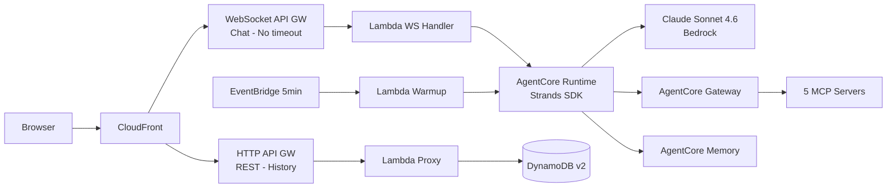

# AWS LaunchPad

AI-powered virtual assistant deployable in customer AWS accounts. Built on Amazon Bedrock AgentCore with Strands Agents SDK to drive GenAI service adoption across monitoring, security, and general AWS guidance.

## Overview

AWS LaunchPad provides a web-based chatbot that customers and partners can deploy in their own AWS accounts with a single `cdk deploy` command. The assistant leverages Amazon Bedrock AgentCore Runtime with MCP-based tool servers to answer AWS questions, monitor infrastructure, assess security posture, and provide controlled guidance — all through a conversational interface.

## Key Features

- **AWS Knowledge:** Real-time access to latest AWS documentation, API references, best practices, and Well-Architected guidance
- **AWS Pricing:** Accurate, real-time pricing information for all AWS services
- **Well-Architected Security:** Security posture assessment against the Well-Architected Framework Security Pillar
- **CloudWatch Monitoring:** Metrics, alarms, logs analysis and operational troubleshooting
- **CloudTrail Auditing:** Event history, error analysis, action traceability and compliance
- **Controlled Actions:** Role-based access (Viewer/Operator) with manual guidance for restricted users

## Architecture



## Tech Stack

| Component | Service |
|-----------|--------|
| Frontend | React + S3 + CloudFront |
| Agent Runtime | Amazon Bedrock AgentCore Runtime (Docker arm64) |
| Agent Framework | Strands Agents SDK |
| Model | Claude Sonnet 4.6 (configurable) |
| Tools | AgentCore Gateway + 5 MCP Servers + 8 boto3 tools |
| Chat API | WebSocket API Gateway (no timeout limit) |
| REST API | HTTP API Gateway (Cognito JWT auth) |
| Auth | Amazon Cognito (MFA TOTP mandatory) |
| Memory | AgentCore Memory (short-term + long-term) + DynamoDB v2 |
| Warmup | EventBridge (5 min) + Lambda ping |
| Observability | AgentCore Observability (CloudWatch) |

## Security

- No static credentials — all components use IAM Roles with temporary credentials (STS)
- Cognito authentication with optional MFA and SAML/OIDC federation
- AgentCore Policy with Cedar for fine-grained authorization of agent actions
- Two permission levels:
  - **Viewer:** Read-only (query metrics, view documentation, pricing lookups)
  - **Operator:** Read + controlled actions (create alarms, enable logging, apply remediations)
- Least privilege IAM policies per component
- Encryption in transit (TLS 1.2+) and at rest (KMS)
- Bedrock Guardrails for content filtering and responsible AI
- CloudTrail audit logging for all agent-initiated API calls
- Destructive actions require explicit user confirmation

## Deployment

### Prerequisites

- AWS CLI configured with appropriate credentials
- Node.js 18+
- AWS CDK CLI (`npm install -g aws-cdk`)

### Quick Start

```bash
git clone git@ssh.gitlab.aws.dev:rayihbou/aws-launchpad.git
cd aws-launchpad
npm install
cdk deploy
```

The stack outputs the application URL. Custom domain and additional parameters can be passed as CDK context:

```bash
cdk deploy \
  -c domainName=assistant.example.com \
  -c hostedZoneId=Z0123456789 \
  -c zoneName=example.com \
  -c language=en \
  -c modelId=us.anthropic.claude-sonnet-4-20250514-v1:0
```

## Development Phases

| Phase | Scope | Status |
|-------|-------|--------|
| Phase 1 (MVP) | CDK stack, Bedrock Agent + KB, CloudWatch Action Group, React chat UI | In Progress |
| Phase 2 | Security Hub and GuardDuty Action Groups | Planned |
| Phase 3 | Resource inventory, Cost Explorer, modernization recommendations | Planned |
| Phase 4 | Controlled actions with confirmation, conversation history, streaming | Planned |

## Future Roadmap

The original LaunchPad vision includes six specialized migration agents (Assessment Automator, Discovery Assistant, Database Modernization Advisor, DR/DRP Planner, Code Modernization Advisor, Post-Migration Documentation Generator). These remain in the roadmap for future phases.

## Author

Rayih Bou — Solutions Architect, AWS LATAM CSC

## License

Amazon Confidential — Internal Use
