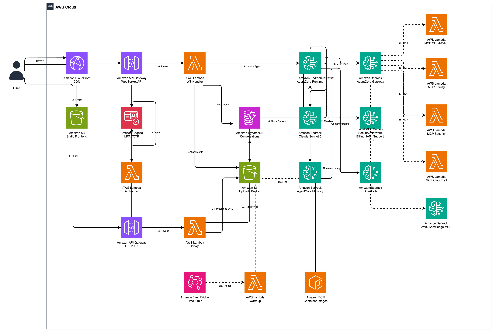

# AWS LaunchPad

AI-powered cloud operations assistant deployable in any AWS account with a single `cdk deploy`. Built on Amazon Bedrock AgentCore with Strands Agents SDK, 120+ MCP tools, and long-term memory.



## What It Does

AWS LaunchPad is a read-only assistant that helps teams monitor, analyze, and troubleshoot their AWS infrastructure through a conversational interface. When it finds issues, it provides ready-to-execute CLI commands — the agent never performs write operations.

**Capabilities:**
- Security posture analysis (Security Hub, GuardDuty, Inspector, WAF, IAM, S3, RDS)
- Cost management (Cost Explorer, budgets, Compute Optimizer, Savings Plans, Free Tier)
- Network diagnostics (VPC, security groups, NACLs, Transit Gateway, flow logs)
- Container operations (ECS clusters/services/tasks, EKS clusters/nodegroups)
- Audit and compliance (CloudTrail events, Config rules, Well-Architected reviews)
- Downloadable HTML reports with AWS Dark Theme and copy-to-clipboard commands
- Long-term memory that remembers user context across sessions
- File attachments (images, PDFs, documents) for analysis
- Multi-language support (English, Spanish, Portuguese)

## Quick Start

### Prerequisites

- An AWS account
- [AWS CloudShell](https://console.aws.amazon.com/cloudshell/) (recommended) or a local environment with Node.js 18+ and Docker

### Deploy

```bash
git clone https://github.com/RayihBou/AWS-Launch-Pad.git
cd AWS-Launch-Pad
./setup.sh
```

The interactive setup will guide you through the configuration:

1. **Admin email** - Receives the initial Cognito password
2. **Language** - Interface language (en/es/pt)
3. **Cross-account visibility** - Enable multi-account support

### Advanced Deploy

If you prefer to run CDK directly:

```bash
npm install
cd frontend && npm install && npm run build && cd ..
cdk bootstrap
cdk deploy -c adminEmail=admin@example.com -c language=es
```

| Parameter | Required | Default | Description |
|-----------|----------|---------|-------------|
| `adminEmail` | Yes | - | Admin email for Cognito |
| `language` | No | `en` | UI language (en/es/pt) |
| `enableCrossAccount` | No | `false` | Multi-account visibility |
| `modelId` | No | `us.anthropic.claude-sonnet-5` | Bedrock model or inference profile ID |
| `domainName` | No | - | Custom domain |
| `hostedZoneId` | No | - | Route 53 Hosted Zone ID |
| `zoneName` | No | - | Route 53 zone name |
| `acceptAnthropicTerms` | No | `false` | Accept the Anthropic terms automatically during preflight |
| `companyName` | No | - | Company name for the Anthropic terms form |
| `companyWebsite` | No | - | Company website (full URL) for the Anthropic terms form |
| `intendedUsers` | No | - | Intended users: `0` internal, `1` external, `2` both |
| `industryOption` | No | - | Industry for the Anthropic terms form (e.g. `Technology`) |
| `useCases` | No | - | Description of the intended use cases |

The last six parameters are only needed if the account has not accepted the Anthropic terms form yet. If model access is already granted, omit them.

### Bedrock Model Access Preflight

The stack includes a Custom Resource that validates access to the configured Bedrock model before the AgentCore Runtime is created: it checks availability, confirms the model is really invocable with a minimal Converse ping, and fails the deployment fast with an actionable message (including the exact AWS CLI command to fix it) instead of deploying a runtime that breaks on the first message. `setup.sh` runs the same validation as its first step, before any build or deploy; if access is missing it asks for the terms form details interactively (company name, website, intended users, industry, use cases) and submits them through the Bedrock API. In `cdk deploy`, the equivalent unattended path is `-c acceptAnthropicTerms=true` plus the company parameters listed above.

Since October 2025 Bedrock enables serverless models by default in new accounts, so in most accounts the preflight just confirms access and asks for nothing.

### Post-deployment

1. Check your email for the temporary Cognito password
2. Open the CloudFront URL from the stack outputs
3. Log in and set a new password + MFA (TOTP)

### Cross-Account Visibility

Cross-account visibility allows the agent to query resources across multiple AWS accounts in your organization.

**Enable during initial deployment:**

The interactive setup will ask if you want to enable cross-account visibility. Alternatively, pass it directly:

```bash
cdk deploy -c adminEmail=admin@example.com -c enableCrossAccount=true
```

**Enable on an existing deployment:**

```bash
npx cdk deploy -c adminEmail=admin@example.com -c language=es -c containerUri=<YOUR_ECR_URI> -c enableCrossAccount=true --require-approval never
```

This updates the existing stack without recreating resources — it adds IAM policies for `sts:AssumeRole` and `organizations:ListAccounts`, and enables 3 additional agent tools.

**Disable on an existing deployment:**

```bash
npx cdk deploy -c adminEmail=admin@example.com -c language=es -c containerUri=<YOUR_ECR_URI> --require-approval never
```

Omitting `-c enableCrossAccount=true` removes the cross-account permissions and tools.

**How it works:**

1. The agent gets access to `list_organization_accounts` to discover accounts
2. It can `generate_cross_account_setup` — a CloudFormation template that creates a `LaunchPadReadOnlyRole` in linked accounts
3. It uses `assume_role` to query resources in linked accounts via the read-only role

**Setup for linked accounts:**

1. Ask the agent: "Generate the cross-account setup template"
2. Deploy the generated CloudFormation template in each linked account
3. The agent can then query resources across all configured accounts

## Architecture

The solution deploys entirely within the customer's AWS account. No data leaves the account except for Bedrock model inference.

| Component | Service |
|-----------|---------|
| Frontend | React + Vite → S3 + CloudFront |
| Agent | Bedrock AgentCore Runtime (Docker arm64, Strands SDK) |
| Model | Claude Sonnet 5 via Amazon Bedrock (configurable) |
| MCP Tools | 6 local servers (stdio) + 5 Gateway targets + 15 boto3 tools |
| Chat API | WebSocket API Gateway (Lambda Authorizer, 900s timeout) |
| REST API | HTTP API Gateway (Cognito JWT auth) |
| Auth | Amazon Cognito (MFA TOTP mandatory) |
| Memory | AgentCore Memory (long-term facts) + DynamoDB (conversation history) |
| Security | Bedrock Guardrails (content filters, PII blocking) |
| Warmup | EventBridge (5 min) + Lambda ping |
| IaC | AWS CDK with @aws-cdk/aws-bedrock-agentcore-alpha |

### MCP Tools (120+)

| Source | Tools | Examples |
|--------|-------|---------|
| Local MCP (stdio) | ~120 | Well-Architected Security, Network, Billing, IAM (readonly), Support, ECS |
| Gateway MCP (Lambda) | ~12 | CloudWatch, Pricing, Security Hub, CloudTrail |
| Gateway MCP (remote) | ~10 | AWS Knowledge (documentation) |
| boto3 @tools | 15 | S3, EC2, CloudWatch, Cost Explorer, EKS, WAF, RDS, HTML reports |

## Security Design

- **Read-only agent:** Never executes write or destructive actions. Provides CLI commands for the user to run in CloudShell
- **No static credentials:** All components use IAM Roles with temporary credentials via STS
- **MFA mandatory:** Cognito TOTP required for all users
- **Least privilege IAM:** Separate policies per MCP server and tool category
- **MCP server protections:** The IAM MCP server runs read-only by default (no flag required); the ECS MCP server runs with `ALLOW_WRITE=false` and `ALLOW_SENSITIVE_DATA=false`; `support:CreateCase` and `support:AddCommunicationToCase` were removed from the Runtime role, so AWS Support write tools are blocked at the IAM role level
- **Single write grant:** The only write permission on the Runtime role is `s3:PutObject`, scoped to the `reports/` prefix of the uploads bucket, used by HTML report generation
- **Content filtering:** A Bedrock Guardrail recalibrated against measured behavior. Content filters block sexual, violent, hate and insulting content at `HIGH`, misconduct at `MEDIUM`, and prompt injection attempts (`PROMPT_ATTACK`) at `MEDIUM` on the input. The PII policy blocks US Social Security and credit/debit card numbers; names, emails and phone numbers are intentionally **not** anonymized, since the agent audits the customer's own account and redacting principals destroyed the usefulness of IAM reports and CloudTrail actor attribution. There is **no topic classification** at all: every DENY topic was removed because intent classifiers cannot tell an IAM or credential *audit* question from a privilege *request* — the two share nearly all their vocabulary — and they blocked legitimate queries that are the agent's own domain. Conversation scope is steered by the system prompt, and write actions are prevented by the Runtime's read-only IAM role rather than by the guardrail. The guardrail is applied only to the user turn through input tagging (`guardContent`), so raw tool output is not re-evaluated on every agent loop. Accepted cost: a bare escalation request with no other harmful signal ("give me admin access") passes the guardrail; containment falls to the read-only IAM role, which cannot execute it
- **Ephemeral file handling:** Attachments auto-delete after processing, reports expire in 24 hours

## Cost Estimation

Based on AWS Pricing API (us-east-1, on-demand). Bedrock tokens dominate ~87% of total cost.

| Usage Level | Users | Messages/month | Estimated Cost |
|-------------|-------|----------------|----------------|
| Low | 5 | 1,000 | $10.17/month |
| Medium | 20 | 4,000 | $40.49/month |
| High | 50 | 10,000 | $101.08/month |

Cognito is free up to 10,000 MAU. Lambda, API Gateway, DynamoDB, and S3 are effectively free at these volumes. See [docs/cost-estimation.html](docs/cost-estimation.html) for detailed breakdown.

> **Note:** These figures reflect Claude Sonnet 5 regional pricing in us-east-1 ($2.20 input / $11.00 output per 1M tokens), which is the rate that applies to the `us.anthropic.claude-sonnet-5` inference profile used by this stack and accounts for approximately 87% of the total cost. The `global.anthropic.claude-sonnet-5` inference profile is 10% cheaper ($2.00 input / $10.00 output) in exchange for routing requests without geographic restriction.

## Project Structure

```
agent/                  # AgentCore Runtime container
  app.py                # Agent: tools, MCP servers, system prompt
  Dockerfile            # Python 3.12-slim + MCP server packages
  requirements.txt      # Dependencies
frontend/               # React frontend (Vite)
  src/components/       # Chat, Header, Login, Sidebar, MessageInput
  src/hooks/            # useAuth, useWebSocket, useIdleTimeout
  src/i18n/             # en.json, es.json, pt.json
scripts/                # Lambda handlers
  websocket/            # ws_handler.py, authorizer.py
  proxy/                # proxy_handler.py
  warmup/               # warmup_handler.py
  preflight/            # preflight_handler.py (Bedrock model access check)
mcp-lambdas/            # Gateway MCP Lambda handlers
  cloudwatch/           # Metrics, alarms, logs
  cloudtrail/           # Audit events
  pricing/              # AWS Pricing API
  wa-security/          # Security Hub, GuardDuty
infra/                  # CDK infrastructure
  bin/app.ts            # CDK app entry point
  lib/launchpad-stack.ts
  lib/constructs/       # auth, agentcore, websocket, api-proxy, frontend, guardrail, mcp-lambdas, preflight
docs/                   # Architecture diagram, cost estimation
```

## Cleanup

To remove all deployed resources:

```bash
cdk destroy
```

This removes all AWS resources created by the stack. Conversation history in DynamoDB and uploaded files in S3 are deleted automatically (removal policy is set to DESTROY).

## Author

Built by Rayih Bou — Solutions Architect, AWS

## License

This project is licensed under the MIT-0 License. See the [LICENSE](LICENSE) file.
